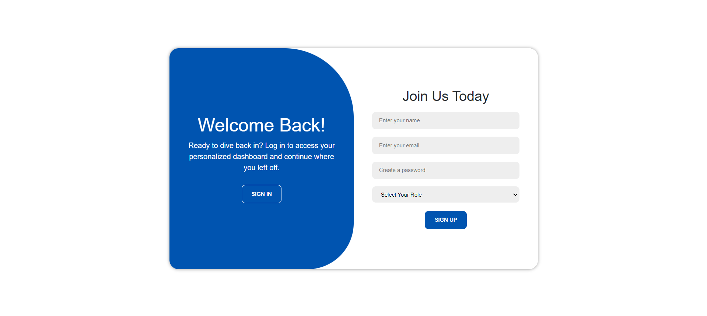
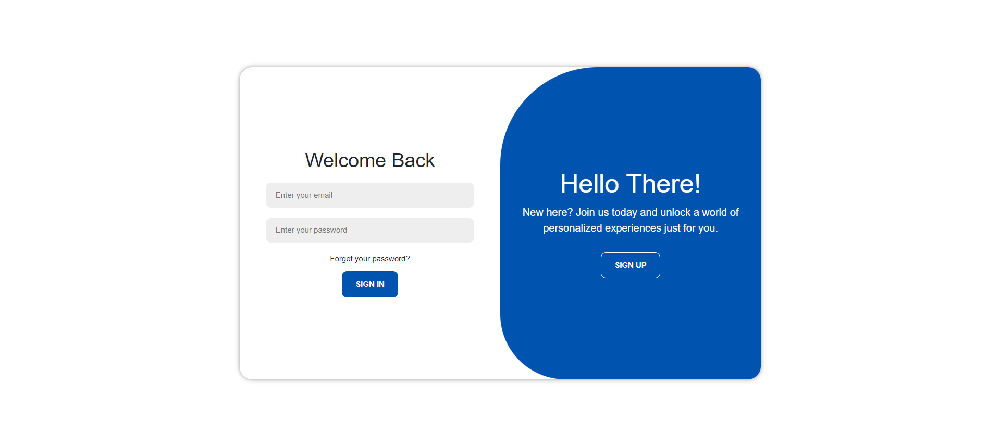

# Simple Login Using JWT

This project demonstrates a simple and secure login system using JSON Web Tokens (JWT) for authentication. It provides a
clear example of how to implement JWT-based authentication in a web application, allowing for secure user login and
session management.

## Tech Stack

### FrontEnd

✅HTML 
✅CSS 
✅JS 
✅AJAX 
✅JQuery 
✅Bootstrap 

### BackEnd

✅SpringBoot 
✅JWT 
✅SpringBoot Security 
✅MySQL 

### Features

✅User Authentication : Secure signup and signin system using JWT. 
✅Role-Based Access Control : Different roles (e.g. ADMIN, USER) with specific permissions. 
✅Token-Based Security : JWT tokens are issued upon successful login and are required to access protected API
routes. 
✅RESTFul API : Endpoints for user registration, login, and accessing protected resources. 
✅Front-End Integration : Simple and intuitive UI for user interaction, including forms for signup and signin. 

## Screenshots

### SignUp

### SignIn

### Customer Management

## Version

1.0.0

⭐️ If you encounter any bugs or issues, or if you have questions about the code, please contact me at: 
[kavithmathushal9007@gmail.com](mailto:kavithmathushal9007@gmail.com)  

#### This project is licensed under the [Apache License](LICENSE)

#### © 2024 All Rights Reserved, Designed By [Kavithma Thushal](https://github.com/Kavithma-Thushal)

